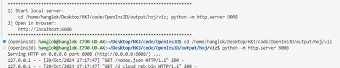
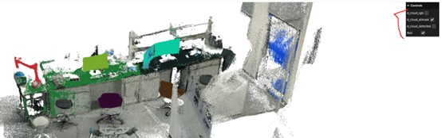

# OpenIns3D说明
服务器文件夹路径： /home/hanglok/Desktop/HXJ/code/OpenIns3D  
[OpenIns3D源代码](https://github.com/Pointcept/OpenIns3D/tree/main?tab=readme-ov-file#reproducing-results)  
## 环境配置
[OpenIns3D环境配置](https://github.com/Pointcept/OpenIns3D/blob/main/installation.md)   
查看电脑安装的cuda版本，查看[pytorch与cuda版本](https://pytorch.org/get-started/previous-versions/) ，安装适合电脑主机的pytorch版本
```
nvcc -V
```  

在4090机器上，已经激活了openins3d，如命令行显示未激活openins3d，可运行以下代码激活  
```
conda activate openins3d
```  
## 代码修改
纯3D文件输入，文件导入路径在 /home/hanglok/Desktop/HXJ/code/OpenIns3D/data/hxj/scenes  

需要修改文件路径和名字，path_masks与path_images均为None, vocabulary 可以是一句话，也可以是一个词语，用来后续进行all mask后的detect操作。detector 选择"odise"/"yoloworld"，一般"odise"效果较好。

```
    name_of_scene = "d_cloud"
    path_3D_scans = f"/home/hanglok/Desktop/HXJ/code/OpenIns3D/data/hxj/scenes/{name_of_scene}.ply"
    path_masks = None
    path_images = None
    vocabulary = "sit"
    detector="odise"
    xyz, rgb, mask_final, mask, v = single_vocabulary_detection(path_3D_scans, vocabulary, path_masks, path_images,detector)
    plot_mask(mask, mask_final, xyz, rgb, name_of_scene, v)
    v.save(f'output/hxj/viz')
```  
### 调整detect参数
如不使用detect，只需要all mask, 则不需要修改下面的代码；需要进行detect，需要根据实际场景进行微调  
修改路径，Snap模块的[800, 800]为顶部虚拟摄像机拍摄的图像大小，[2, 0.5, 1.0]为调整相机摆放的参数，分别指self.lift_cam（相机抬起高度）, self.zoomout（缩放）, self.remove_lip（去除天花板高度）  
Lookup模块的0.5为sself.remove_lip（去除天花板高度），可以不需要和上面的snap保持一致。
```
    snap_class = Snap([800, 800], [2, 0.5, 1.0], "output/hxj_snap")
    lookup_class = Lookup([800, 800], 0.5, "output/hxj_snap", text_input=[vocabulary], results_folder="output/hxj_results")
```  
可以通过调整threshold来增加检测能力
```
    if path_images:
        mask_classfication, score = lookup_class.lookup_pipelie(xyz_rgb, mask, name_of_scene, threshold = 0.6, use_2d=True, single_detection=True)
    else:
        mask_classfication, score = lookup_class.lookup_pipelie(xyz_rgb, mask, name_of_scene, threshold = 0.6, use_2d=False, single_detection=True)
```  
## 代码运行与结果展示
只需要点击运行即可，或者运行代码
```
python	single_voc.py
```  
提示运行以下代码
```
cd  /home/hanglok/Desktop/HXJ/code/OpenIns3D/output/hxj/viz
python -m http.server 6008
```  
效果如下  
  
在编译器里点击 http://localhost:6008 链接，在本地浏览器打开，即可得到以下效果图，通过勾选右上角来选择想要看到的画面  
  
中间过程的结果图可以在 /home/hanglok/Desktop/HXJ/code/OpenIns3D/output 中进行查看